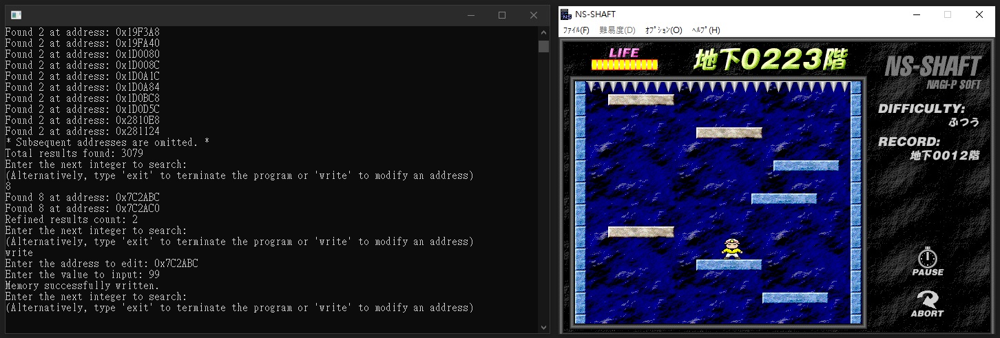

# C# Memory Tool

This project is the outcome of my current practice in C# memory management. This kind of tool often serves as a "trainer" for games, a common term used for tools that modify computer memory to alter game states, such as lives, money or scores. It provides basic features such as scanning and modifying the memory value of any process (or game).

## Screenshots

## Project Overview

This tool provides functionalities to memory handling. However, there are a few limitations:

- Error handling is not fully implemented.
- It does not track values affected by garbage collection.
- It may not work against advanced memory protection mechanisms found in commercial games.

## Usage

To use this toolkit, follow these steps:

1. Execute the program with administrator privileges.
2. Follow the prompts provided by the program.

## Future Developments

This tool is part of my continuing exploration into C#, and I plan to continue improving.

## Feedback

Feedback, suggestions, and Pull Requests are more than welcome. Any contributions you make are greatly appreciated.

## License

This project is licensed under the terms of the [MIT License](https://opensource.org/licenses/MIT).